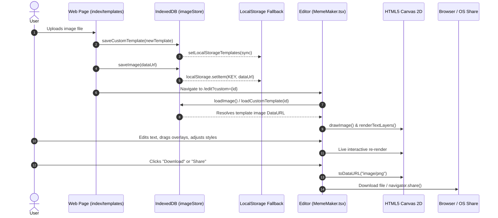

# MemeMaker — Design & Architecture Specification

MemeMaker is an ultra-fast, browser-native meme creation platform engineered for culture speed, zero friction, and high-fidelity rendering. The core ethos is **"Make the meme before it gets old"** — delivering immediate creation capability with zero forced signups, zero watermarks by default, zero server-side rendering bottlenecks, and direct client-side export capabilities.

---

## 1. UX Principles & Interaction Architecture

```
   ┌────────────────────────────────────────────────────────┐
   │                     LANDING PAGE                       │
   │  • Floating 20-template scatter gallery (interactive)  │
   │  • Deterministic cached layout (no reshuffling)        │
   │  • Centered drag & drop dropzone / file picker         │
   │  • Instant IndexedDB handoff (zero server latency)     │
   └───────────┬────────────────────────────────────────────┘
               │
               ▼
   ┌────────────────────────────────────────────────────────┐
   │                  TEMPLATES DIRECTORY                   │
   │  • Search bar & Category filter pills                  │
   │  • Custom user templates with XSS-safe gallery         │
   │  • Direct custom template upload & quick deletion      │
   └───────────┬────────────────────────────────────────────┘
               │
               ▼
   ┌────────────────────────────────────────────────────────┐
   │                    EDITOR STUDIO                       │
   │  • Real-time HTML5 2D Canvas Engine                    │
   │  • Classic Top/Bottom meme text + outline stroke       │
   │  • Freeform draggable text overlays (pointer capture)  │
   │  • Multi-font selection, color pickers, padding bars   │
   │  • AI prompt/caption inspiration                       │
   │  • Instant client PNG/JPEG/WebP export & Web Share API │
   └───────────┬────────────────────────────────────────────┘
               │
               ▼
   ┌────────────────────────────────────────────────────────┐
   │               OPTIONAL CLOUD ECOSYSTEM                 │
   │  • Supabase OAuth (Google) & Email/Password            │
   │  • Automatic user attribution for custom templates     │
   │  • Avatar initial / image profile badge                │
   └────────────────────────────────────────────────────────┘
```

### Core Design Principles

1. **Zero-Latency Creation**: Users land directly in the experience. Creating or customizing a meme requires no waiting for server cold-starts or backend image queues.
2. **Tactile Meme Culture Aesthetics**: Near-black obsidian canvas (`#0a0a0c`) contrasted against high-voltage electric meme yellow (`#f4ff39`), refined with crisp Inter typography, JetBrains Mono eyebrows, and classic Impact display text.
3. **Deterministic State Continuity**: Visual layouts (such as the landing scatter gallery) are deterministically generated and cached in `localStorage` to avoid jarring reshuffles on back-navigation.
4. **Client-First Privacy & Security**: All image manipulations remain on the user's device. User-uploaded custom templates are safely isolated in client-side storage with comprehensive XSS protection and safe URI validation.
5. **Direct Manipulation**: Draggable text layers utilize pointer capture and normalized coordinate spaces ($[0, 1] \times [0, 1]$) to ensure pixel-perfect positioning across device orientations.

---

## 2. Visual Design System

### 2.1 Color Palette & Theme Tokens

The theme is configured using Tailwind CSS v4 (`@theme` in `src/styles/global.css`):

| Token Name | Hex / Value | Semantic Role & Application |
| :--- | :--- | :--- |
| `--color-primary` | `#f4ff39` | High-voltage meme yellow; primary CTA button, active highlights, selection fill |
| `--color-on-primary` | `#0a0a0a` | Deep obsidian ink for optimal contrast on primary yellow surfaces |
| `--color-canvas-soft` | `#0a0a0c` | Deep body canvas background for clean dark-mode depth |
| `--color-canvas` | `#131316` | Elevated surface tone for modals, cards, and dropdown containers |
| `--color-canvas-soft-2` | `#1c1c21` | Secondary surface tone for inset controls, wells, and toolbars |
| `--color-ink` | `#f5f5f5` | High-contrast off-white for headings and primary copy |
| `--color-body` | `#b8b8b8` | Neutral light slate for subheadings, captions, and secondary links |
| `--color-mute` | `#7d7d85` | Subdued slate for metadata, placeholders, and subtle borders |
| `--color-hairline` | `rgba(255,255,255,0.10)` | 1px border dividers, floating pill outlines, and separator rules |
| `--color-hairline-strong`| `rgba(255,255,255,0.24)` | High-contrast boundaries, active ring indicators, and card hovers |
| `--color-cyan` | `#50e3c2` | Electric cyan for editor status indicators and secondary gradients |
| `--color-violet` | `#a855f7` | Deep purple for atmospheric brand glow and badge highlights |
| `--color-highlight-pink` | `#ff2d95` | Neon magenta for playful accents and hero gradient stops |
| `--color-success` | `#3ddc97` | Vivid emerald for positive auth alerts and copy confirmations |
| `--color-error` | `#ff5470` | Coral red for auth validation failures and destructive actions |

### 2.2 Atmospheric Brand Mesh Gradient

Applied as an ambient background layer behind the hero viewports:

```css
.mesh-gradient {
  background-image:
    radial-gradient(circle at 15% 20%, #007cf0 0%, transparent 45%),
    radial-gradient(circle at 85% 15%, #50e3c2 0%, transparent 40%),
    radial-gradient(circle at 75% 70%, #ff2d95 0%, transparent 45%),
    radial-gradient(circle at 30% 85%, #a855f7 0%, transparent 45%),
    radial-gradient(circle at 60% 40%, #f9cb28 0%, transparent 40%);
  filter: blur(70px) saturate(160%);
  opacity: 0.4;
}
```

### 2.3 Typography Matrix

| Font Hierarchy | Family | Weights | Role & Applications |
| :--- | :--- | :--- | :--- |
| **Narrative & UI** | Inter | 400, 500, 600, 700 | Primary UI labels, body text, buttons, modals, navigation |
| **Technical / Monospace** | JetBrains Mono | 400, 500 | Slogans ("MAKE MEMES, NOT MEETINGS."), badges, metadata |
| **Meme Overlay** | Impact, Arial Black, Comic Sans MS, Montserrat, Pacifico, Anton | 400 – 900 | Dynamic canvas text rendering with configurable stroke outlines |

---

## 3. Technology Stack & Directory Structure

```
                          ┌───────────────────────────┐
                          │     Astro v7 Platform     │
                          │  Static / Island Router   │
                          └─────────────┬─────────────┘
                                         │
            ┌────────────────────────────┼────────────────────────────┐
            ▼                            ▼                            ▼
 ┌───────────────────────┐    ┌──────────────────────┐    ┌───────────────────────┐
 │   Astro Page Shells   │    │  React 19 Islands    │    │ Client Storage / SDKs │
 │  • index.astro        │    │  • MemeMaker.tsx     │    │  • IndexedDB Store    │
 │  • templates.astro    │    │  • ShadcnDemo.tsx    │    │  • Supabase JS Client │
 │  • edit.astro         │    │  • ui/button, card   │    │  • Web Share / Canvas │
 │  • about/contact/...  │    │                      │    │  • templateCache.ts   │
 └───────────────────────┘    └──────────────────────┘    └───────────────────────┘
```

### 3.1 Stack Breakdown

- **Framework**: [Astro v7](https://docs.astro.build) with SSG static site generation (`output: "static"`).
- **Interactive Islands**: [React 19](https://react.dev) (`@astrojs/react`) with client hydration (`client:load`).
- **Styling Architecture**: [Tailwind CSS v4](https://tailwindcss.com) via `@tailwindcss/vite` and CSS variables.
- **Components**: [shadcn/ui](https://ui.shadcn.com) primitives with Radix UI Slot, `clsx`, `tailwind-merge`, and `class-variance-authority`.
- **Identity & Auth**: [Supabase](https://supabase.com) JavaScript SDK (`@supabase/supabase-js`) supporting Google OAuth and Email/Password flows.
- **Client Storage Engine**: Custom dual-tier storage (`src/lib/imageStore.ts`) leveraging IndexedDB v2 with graceful `localStorage`/`sessionStorage` synchronization and automatic quota recovery.
- **Testing**: [Vitest](https://vitest.dev) suite with JSDOM and Fake IndexedDB simulating client environments.
- **Architecture Knowledge Graph**: [Graphify](https://github.com) AST dependency extraction and continuous graph tracking.

---

## 4. Pages & Routes Architecture

### 4.1 Home Page (`/` — `src/pages/index.astro`)

The high-conversion entry point combining interactive visual exploration with instant upload:

1. **Floating 20-Card Scatter Gallery**:
   - Renders 20 popular meme templates from `/templates/cdn/{id}.webp`.
   - Utilizes `getLandingTemplatesLayout()` to calculate and persist random positions, widths, rotations, and z-indices in `localStorage`.
   - Hovering smoothly scales cards (`scale(1.08)`), resets tilt to `0deg`, and promotes z-index.
   - Clicking any card saves the template URL and navigates directly to `/edit?template={id}`.
2. **Central Upload Dropzone**:
   - High-contrast frosted glass container with smooth drop state animation (`is-dragging`).
   - Supports drag-and-drop or manual file picking (`.png`, `.jpg`, `.jpeg`, `.webp`, `.gif`).
   - Reads files via `FileReader`, generates a unique custom template ID, saves to IndexedDB with Supabase user ID attribution (`userId`), and redirects to `/edit?custom={id}`.

### 4.2 Templates Gallery (`/templates` — `src/pages/templates.astro`)

The comprehensive template discovery hub:

1. **Filter Categories**:
   - Category navigation pills: *All*, *Trending*, *Classics*, *Reactions*, *Gaming*, and *Custom*.
   - Dynamic counter badges showing template counts per category.
2. **Real-time Search**:
   - Client-side search filtering template titles and tags instantly as the user types.
3. **Custom User Templates Section**:
   - Dynamically loads custom templates saved in IndexedDB / localStorage.
   - Built with strict XSS sanitization (`escapeHtml`, `CSS.escape`, `encodeURIComponent`, and safe URI protocol checks).
   - Card features a quick "Delete" button with confirmation prompt, and an "Edit template" overlay button.
4. **Direct Upload Card**:
   - Seamless dropzone card integrated directly within the masonry grid allowing new template additions on the fly.

### 4.3 Studio Editor (`/edit` — `src/pages/edit.astro` & `src/components/MemeMaker.tsx`)

The core editing environment featuring a responsive 2-column layout:

1. **2D Canvas Rendering Engine**:
   - Responsive canvas scaling adapting dynamically to natural image aspect ratios (max width: `1000px`).
   - Text outline rendering with black stroke (`ctx.strokeStyle = "#000"`, `lineWidth = Math.max(4, size / 10)`) ensuring readability on any background.
   - Draggable text overlays with normalized coordinates $(x, y) \in [0, 1] \times [0, 1]$ and pointer capture (`setPointerCapture`) for smooth movement across mouse and touch devices.
2. **Rich Typography & Styling Controls**:
   - Font family picker supporting Impact, Arial, Comic Sans MS, Montserrat, Pacifico, Anton, Roboto, and Open Sans.
   - Real-time font size slider (range 20px to 100px).
   - Text color and stroke color pickers.
   - Top and bottom padding / spacing controls (e.g. classic meme banner format).
3. **Template Carousel & Alias Matching**:
   - Built-in horizontal carousel of preset templates plus blank canvas option.
   - Robust alias mapping (`TEMPLATE_ALIAS_MAP`) resolving friendly names (e.g., `distracted-boyfriend`, `change-my-mind`, `buff-doge`, `anakin-and-padme`, `harold`) to numeric template IDs.
4. **AI Caption Generator / Prompt Assistant**:
   - Built-in prompt generator offering contextual meme captions for creative inspiration.
5. **Export & Sharing Pipeline**:
   - High-resolution download in PNG, JPEG, or WebP format.
   - Direct Copy to Clipboard via `navigator.clipboard.write([new ClipboardItem(...)])`.
   - Native mobile sharing via Web Share API (`navigator.share({ files: [...] })`).

### 4.4 Global Navigation & Modals

1. **Header Pill (`src/components/Header.astro`)**:
   - Floating pill navigation bar (`bg-[#1b1b1b]/95 backdrop-blur-xl`).
   - Centered monospace slogan: `"MAKE MEMES, NOT MEETINGS."`.
   - Interactive Supabase Auth state:
     - Logged out: Sign In / Sign Up button triggering modal.
     - Logged in: Profile avatar pill with Google profile picture or generated initials fallback via `getAvatarDisplay()`, with one-click sign out.
2. **Authentication Modal (`src/components/AuthModal.astro`)**:
   - Accessible modal dialog (`role="dialog"`, `aria-modal="true"`).
   - One-click Google OAuth authentication via `supabase.auth.signInWithOAuth({ provider: 'google' })`.
   - Email/password Sign In and Sign Up tabbed forms with error handling and success notifications.
   - Dismissible via Escape key, close button, or backdrop click.
3. **Footer Pill (`src/components/Footer.astro`)**:
   - Sleek footer container housing brand mark, copyright, and navigation links to About, Contact, Privacy, Terms, and GitHub.
4. **Utility Routes**:
   - `/about`: Project story, mission, and technology overview.
   - `/contact`: Contact channel and feedback details.
   - `/privacy` & `/terms`: Legal disclosures and terms of use.
   - `/404` & `/500`: Custom stylized error pages keeping users within the application flow.
   - `/sitemap.xml`: Auto-generated XML sitemap covering all canonical routes.

---

## 5. Client Data Flow & Storage Architecture



### 5.1 Dual-Tier Storage Engine (`src/lib/imageStore.ts`)

- **Database**: `meme-image-store`, Version: `2`
- **Object Stores**:
  - `images`: Key-value store for transient editor images (`pending-meme-image`).
  - `custom_templates`: Structured store with `id` keypath and indexes on `userId` and `createdAt`.
- **Quota Exceeded Recovery**:
  - When saving large base64 images, `localStorage` may throw a `QuotaExceededError`.
  - `saveImage()` catches quota exceptions, immediately clears the stale key to prevent corrupt state, and falls back seamlessly to IndexedDB which provides hundreds of megabytes of reliable storage.

### 5.2 Deterministic Layout Cache (`src/lib/templateCache.ts`)

- Stores the computed positions, sizes, and tilt angles of cards on the landing page in `mememaker_landing_templates_layout`.
- Prevents annoying layout shifts and reshuffling when navigating back to the homepage from the editor or templates catalog.

---

## 6. Security Architecture

1. **XSS Protection in Client Templates**:
   - Custom template names are strictly sanitized using `escapeHtml()` before insertion into any HTML string or attribute.
   - Template IDs in URL parameters are encoded with `encodeURIComponent()`.
   - DOM lookups sanitize identifiers using `CSS.escape()`.
2. **Safe Image URL Protocol Enforcement**:
   - Dynamic template preview images validate protocol prefixes (`data:image/`, `blob:`, `/`, `http://`, `https://`), preventing `javascript:` injection attacks.
3. **Client-Isolated Image Processing**:
   - User photos and canvas edits remain entirely on the client's device, eliminating cloud exposure or server leak vectors for private images.

---

## 7. Verification & Quality Gates

The codebase enforces quality via an automated Vitest test suite and static build validation:

- **Unit Tests (`tests/`)**:
  - `imageStore.test.ts`: Quota error handling, IndexedDB CRUD, and localStorage syncing.
  - `templateCache.test.ts`: Layout generation determinism and corruption recovery.
  - `avatar.test.ts`: User avatar URL resolution, metadata initials extraction, and null safety.
  - `memeMaker.test.ts`: Template alias resolution, normalized coordinate constraints, and bounds checking.
  - `sitemap.test.ts`: Comprehensive static route verification in generated sitemap.
- **Build Verification**:
  - `npm test`: Runs Vitest suite (23 tests passing).
  - `npm run build`: Executes `astro build` static output compilation.
  - `graphify update .`: Synchronizes the project's architectural knowledge graph.
