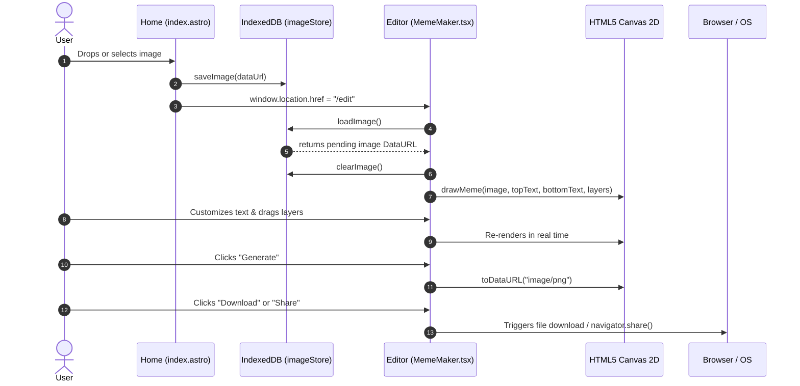

# MemeMaker — Design & Architecture Specification

MemeMaker is an ultra-responsive, browser-native meme creation platform designed for speed, delight, and viral culture. The product's core value proposition is **"Make the meme before it gets old"** — delivering immediate, zero-friction meme generation with zero required authentication, zero forced watermarks, zero server-side rendering latency, and native device sharing.

---

## 1. Product Vision & UX Principles

```
   ┌────────────────────────────────────────────────────────┐
   │                     LANDING PAGE                       │
   │  • Floating 20-template scatter gallery (interactive)  │
   │  • Centered drag & drop dropzone / file picker         │
   │  • Instant IndexedDB handoff (zero server latency)     │
   └───────────────────────────┬────────────────────────────┘
                               │
                               ▼
   ┌────────────────────────────────────────────────────────┐
   │                    EDITOR STUDIO                       │
   │  • Real-time HTML5 2D Canvas Engine                    │
   │  • Classic Top/Bottom meme text rendering              │
   │  • Freeform draggable text overlays (pointer capture)  │
   │  • Instant client PNG export & Web Share API           │
   └───────────────────────────┬────────────────────────────┘
                               │
                               ▼
   ┌────────────────────────────────────────────────────────┐
   │               OPTIONAL CLOUD ECOSYSTEM                 │
   │  • Supabase OAuth (Google) & Email/Password            │
   │  • Persistent gallery & user profile synchronization   │
   └────────────────────────────────────────────────────────┘
```

### Core Design Principles

1. **Instant Gratification Over Bureaucracy**: Users can start creating memes within 500ms of loading the website. No forced logins, paywalls, or upload delays.
2. **Tactile Meme Culture Aesthetics**: A sleek dark mode foundation (`#0a0a0c`) energized with high-voltage neon yellow (`#f4ff39`) and playful typography (Impact + Inter + JetBrains Mono).
3. **Responsive Hybrid Rendering**: Zero server turnaround for rendering — all image manipulation, text rendering, and PNG generation happens client-side in the user's browser using HTML5 Canvas and IndexedDB.
4. **Fluid Motion & Direct Manipulation**: Meme text can be dragged naturally across the canvas with real-time pointer capture and responsive coordinate projection.

---

## 2. Visual Design System

### 2.1 Color Palette & Theme Tokens

The design is built on a dark-first canvas architecture configured via Tailwind CSS v4 (`@theme` in `src/styles/global.css`):

| Token Name | Hex / Value | Semantic Role & Application |
| :--- | :--- | :--- |
| `--color-primary` | `#f4ff39` | High-voltage meme yellow; primary CTA button, active highlights, selection fill |
| `--color-on-primary` | `#0a0a0a` | Deep black ink for maximum contrast on primary surfaces |
| `--color-canvas-soft` | `#0a0a0c` | Deep obsidian background for page body and backdrop |
| `--color-canvas` | `#131316` | Slightly elevated background for modals, cards, and dropdowns |
| `--color-canvas-soft-2` | `#1c1c21` | Secondary surface tone for inset wells and subtle container divisions |
| `--color-ink` | `#f5f5f5` | Pure near-white typography for headings and high-priority copy |
| `--color-body` | `#b8b8b8` | Neutral light gray for subheadings, captions, and secondary links |
| `--color-mute` | `#7d7d85` | Subdued slate for metadata, placeholders, and subtle borders |
| `--color-hairline` | `rgba(255,255,255,0.10)` | 1px border dividers, floating pill outlines, and table rules |
| `--color-hairline-strong`| `rgba(255,255,255,0.24)` | High-contrast boundaries, hover borders, and active ring indicators |
| `--color-cyan` | `#50e3c2` | Electric cyan for editor status badges and secondary gradient stops |
| `--color-violet` | `#a855f7` | Deep purple for atmospheric mesh gradient and feature accents |
| `--color-highlight-pink` | `#ff2d95` | Neon magenta for playful secondary CTAs and hero gradients |
| `--color-success` | `#3ddc97` | Vivid emerald for positive auth alerts and copy confirmations |
| `--color-error` | `#ff5470` | Bright coral red for auth failures and destructive actions |

### 2.2 Atmospheric Brand Mesh Gradient

A decorative ambient glow utilized behind hero elements and marketing bands:

```css
.mesh-gradient {
  background-image:
    radial-gradient(circle at 15% 20%, #007cf0 0%, transparent 45%),
    radial-gradient(circle at 85% 15%, #50e3c2 0%, transparent 40%),
    radial-gradient(circle at 75% 70%, #ff2d95 0%, transparent 45%),
    radial-gradient(circle at 30% 85%, #a855f7 0%, transparent 45%),
    radial-gradient(circle at 60% 40%, #f9cb28 0%, transparent 40%);
  filter: blur(70px) saturate(160%);
  opacity: 0.4;
}
```

### 2.3 Typography Matrix

The app employs a deliberate 3-tier font strategy:

```
┌─────────────────────────┬──────────────────────────────────────────┬─────────────────────────────────┐
│ Tier                    │ Font Family                              │ Primary Application             │
├─────────────────────────┼──────────────────────────────────────────┼─────────────────────────────────┤
│ 1. Narrative & UI       │ Inter (400, 500, 600, 700)               │ Headings, UI labels, buttons    │
│ 2. Technical / Eyebrows │ JetBrains Mono (400, 500)                │ Slogans, badges, counters       │
│ 3. Meme Canvas & Stroke │ Impact, "Arial Black", sans-serif (900)  │ Canvas meme overlay text        │
└─────────────────────────┴──────────────────────────────────────────┴─────────────────────────────────┘
```

* **Display Heading**: `font-sans font-semibold tracking-[-0.055em] text-[#f1f1f1]`
* **Eyebrows & Metadata**: `font-mono text-[9px] uppercase tracking-[0.18em] text-[#929292]`
* **Canvas Meme Text**: `font-weight: 900`, `Impact, Arial Black, sans-serif`, with black text stroke (`ctx.strokeStyle = "#000"`, `lineWidth = Math.max(4, size / 10)`).

---

## 3. Architecture & Technical Stack

```
                          ┌───────────────────────────┐
                          │     Astro v7 Platform     │
                          │  Static / Island Router   │
                          └─────────────┬─────────────┘
                                        │
           ┌────────────────────────────┼────────────────────────────┐
           ▼                            ▼                            ▼
┌───────────────────────┐    ┌──────────────────────┐    ┌───────────────────────┐
│   Astro Page Shells   │    │  React 19 Islands    │    │ Client Storage / SDKs │
│  • index.astro        │    │  • MemeMaker.tsx     │    │  • IndexedDB Store    │
│  • edit.astro         │    │  • ShadcnDemo.tsx    │    │  • Supabase JS Client │
│  • Layout.astro       │    │  • UI Primitives     │    │  • Web Share / Canvas │
└───────────────────────┘    └──────────────────────┘    └───────────────────────┘
```

### 3.1 Stack Breakdown

- **Core Web Framework**: Astro v7 with SSR/SSG file-based routing (`src/pages/index.astro`, `src/pages/edit.astro`).
- **Client Interactive Layer**: React 19 (`@astrojs/react`) with client hydration (`client:load`).
- **Styling Architecture**: Tailwind CSS v4 via `@tailwindcss/vite` plugin with CSS `@theme` variables and utility layers.
- **Component Primitives**: shadcn/ui configured in `components.json` with Radix UI Slot, `clsx`, `tailwind-merge`, and `class-variance-authority`.
- **Iconography**: `lucide-react` (Sparkles, CheckCircle2, Flame, Share, Download, etc.).
- **Typography Integration**: `@fontsource/inter` and `@fontsource/jetbrains-mono`.
- **Identity & Authentication**: Supabase (`@supabase/supabase-js`) supporting Google OAuth and Email/Password flows.
- **Client-Side Storage**: IndexedDB wrapper (`src/lib/imageStore.ts`) providing zero-latency image caching for oversized raw DataURLs.
- **Asset Distribution**: DigitalOcean Spaces CDN (`mememaker-templates.nyc3.cdn.digitaloceanspaces.com`).
- **Codebase Knowledge Graph**: Graphify toolchain (`graphify extract . --code-only && graphify cluster-only .`).

---

## 4. Page Layouts & Component Breakdown

### 4.1 Global Navigation Header (`src/components/Header.astro`)

A sticky, floating pill navbar (`max-w-350 mx-auto`, `h-14`) rendered above all pages:

* **Brand Anchor**: Custom SVG emblem badge paired with `MemeMaker` wordmark.
* **Centered Monospace Slogan**: `"MAKE MEMES, NOT MEETINGS."` in `JetBrains Mono` (`text-[10px] tracking-[0.16em] text-[#9b9b9b]`).
* **Dynamic Supabase Auth State**:
  * *Unauthenticated*: `"Sign up"` button triggering the modal.
  * *Authenticated*: User pill displaying dynamic Google/OAuth avatar with uppercase initial fallback and one-click sign-out action.

### 4.2 Authentication Modal (`src/components/AuthModal.astro`)

An accessible, backdrop-blurred dialog (`role="dialog"`, `aria-modal="true"`):
* **Tab Switcher**: Seamless toggle between `"Sign In"` and `"Create Account"`.
* **One-Click Google OAuth**: `supabase.auth.signInWithOAuth({ provider: 'google' })`.
* **Credential Authentication**: Reactive Email + Password form with error and success banner messaging.
* **Keyboard & Clickaway Hooks**: Closed via Escape key or backdrop tap; declared globally on `window.openAuthModal` and `window.closeAuthModal`.

### 4.3 Home Page (`src/pages/index.astro`)

The viral entry point featuring two interconnected layers:

#### A. Interactive Floating Template Scatter Gallery
* 20 randomized meme templates fetched from DigitalOcean Spaces CDN.
* Mathematical random placement algorithm distributing templates across 5 columns and 4 rows:
  ```ts
  const column = position % 5;
  const row = Math.floor(position / 5);
  card.style.setProperty("--card-width", `${randomBetween(14.85, 22.95).toFixed(2)}rem`);
  card.style.setProperty("--card-left", `${Math.max(-5, Math.min(72, column * 18 + randomBetween(-7, 7))).toFixed(2)}%`);
  card.style.setProperty("--card-top", `${Math.max(-8, Math.min(66, row * 23 + randomBetween(-8, 8))).toFixed(2)}%`);
  card.style.setProperty("--rotation", `${randomBetween(-16, 16).toFixed(2)}deg`);
  ```
* Hover & Focus expansion: Cards smoothly rotate to `0deg` and scale up (`scale(1.08)`), bringing forward template action badges.

#### B. Central Drag & Drop Upload Zone
* High-contrast frosted glass container (`bg-black/80 backdrop-blur-xl border-white/10`).
* Deep drag-and-drop listener tracking (`dragenter`, `dragover`, `dragleave`, `drop`) with visual scale and border transitions (`is-dragging`).
* Supported MIME types: `image/png`, `image/jpeg`, `image/webp`, `image/gif`.
* Automatic handoff pipeline: Reads file via `FileReader`, persists into IndexedDB (`saveImage()`), and executes client-side redirect to `/edit`.

```
[ User Drops Image ] ─► [ FileReader: readAsDataURL ] ─► [ IndexedDB: saveImage() ] ─► [ Redirect: /edit ]
```

### 4.4 Editor Studio (`src/pages/edit.astro` & `src/components/MemeMaker.tsx`)

The studio workspace is split into a 2-column responsive layout (1.05fr preview / 0.95fr controls):

```
┌───────────────────────────────────────┬──────────────────────────────────────────┐
│          PREVIEW WORKSPACE            │             CONTROL PANEL                │
│                                       │                                          │
│  ┌─────────────────────────────────┐  │  • Upload New Template / Search Bar      │
│  │ ↶ Undo | Spacing | + Image | Draw│  │  • Template Carousel (Blank + Presets)   │
│  ├─────────────────────────────────┤  │  • Top Text & Color Picker               │
│  │                                 │  │  • Bottom Text & Color Picker            │
│  │       HTML5 Canvas Stage        │  │  • Font Size Slider (20px - 100px)       │
│  │                                 │  │  • Extra Layer Manager (+ Drag Text)     │
│  │    [ Draggable Text Overlay ]   │  │  • Checkboxes: Watermark/Private/Anon    │
│  │                                 │  │  • Generate Meme & Reset Buttons         │
│  ├─────────────────────────────────┤  └──────────────────────────────────────────┘
│  │ [ Download PNG ]  [ Share Web ] │  ┌──────────────────────────────────────────┐
│  └─────────────────────────────────┘  │ AI Banner & Featured Template Gallery    │
└───────────────────────────────────────┴──────────────────────────────────────────┘
```

#### Canvas Rendering Engine Specifications:
1. **Dynamic Scaling**: The canvas bounds adapt to natural image aspect ratios up to `maxWidth: 1000px`:
   $$\text{scale} = \min\left(1, \frac{1000}{\text{img.naturalWidth}}\right)$$
   $$\text{width} = \text{img.naturalWidth} \times \text{scale},\quad \text{height} = \text{img.naturalHeight} \times \text{scale}$$
2. **Text Outline & Fill Rendering**:
   * Outlines are rendered first with `#000000` stroke at `lineWidth = Math.max(4, size / 10)` to ensure contrast on any image backdrop.
   * Fills are rendered second with user-selected color (`#ffffff` default).
3. **Draggable Text Layers**:
   * Text layers (`TextLayer`) store normalized coordinates $(x, y) \in [0, 1] \times [0, 1]$.
   * Pointer capture (`setPointerCapture`) ensures uninterrupted dragging on touchscreens and high-DPI desktop mice.
   * HTML overlay handles mirror canvas coordinates during editing for seamless live dragging, then bake directly into the 2D canvas context on export.
4. **Watermark Engine**:
   * Configurable watermark toggle rendering `"MemeForge"` in the bottom-left canvas margin (`12px` offset, `rgba(255,255,255,0.75)`).

---

## 5. Client Data Flow & State Management



### IndexedDB Specification (`src/lib/imageStore.ts`)

* **Database Name**: `meme-image-store`
* **Version**: `1`
* **Object Store**: `images`
* **Key**: `pending-meme-image`
* **Lifecycle**: `saveImage()` writes the payload upon upload; `loadImage()` reads and immediately calls `clearImage()` to prevent stale memory caching.

---

## 6. Responsive Breakpoints & Accessibility

### 6.1 Breakpoint Strategy

| Breakpoint | Target Devices | Layout Behavior |
| :--- | :--- | :--- |
| **`>= 1024px`** (lg) | Desktop | Floating 20-card scatter canvas, 2-column editor studio (canvas left, controls right), sticky header. |
| **`768px - 1023px`** (md) | Tablets | 3-column template grid on home, stacked editor layout (canvas above controls, 600px max height). |
| **`< 768px`** (sm) | Mobile Devices | 2-column template grid, full-width touch-optimized dropzone, single-column scrollable editor, horizontal toolbar overflow. |

### 6.2 Accessibility & Motion Standards

* **Reduced Motion Compliance**:
  ```css
  @media (prefers-reduced-motion: reduce) {
    *, *::before, *::after {
      animation-duration: 0.01ms !important;
      transition-duration: 0.01ms !important;
      transform: none !important;
    }
  }
  ```
* **Contrast & Focus Rings**: All interactive buttons feature explicit `focus-visible:ring-2 focus-visible:ring-white` indicators with offset backgrounds.
* **ARIA Landmarks**: Main navigation uses `<header>`, primary content resides in `<main>`, dialogs declare `role="dialog"` with `aria-modal="true"`, and live status updates use `aria-live="polite"`.

---

## 7. Knowledge Graph & Developer Tooling

This project integrates **Graphify** for continuous codebase architecture visualization and AST dependency tracking:

* **Visual Graph**: `graphify-out/graph.html`
* **Structure Report**: `graphify-out/GRAPH_REPORT.md`
* **Rebuild Graph**: `npm run graphify`
* **Export Visualization**: `npm run graphify:export`
